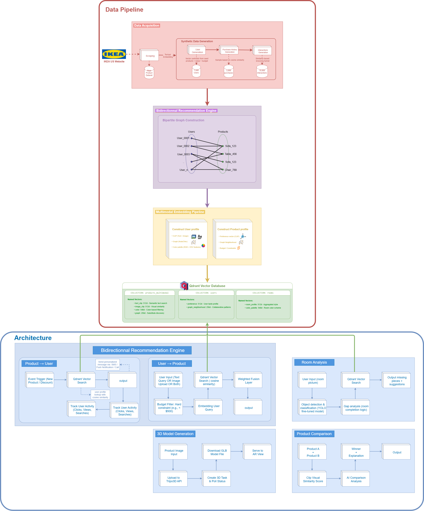

# Furniverse

AI-powered furniture e-commerce platform featuring multimodal semantic search, room analysis, product comparison, and AR visualization.


---

## What is this?

A furniture recommendation system that works in **three directions**:

1. **User → Product**: Natural language queries + image uploads → semantic product matching
2. **Product → User**: Given a product, find users who'd want it (collaborative signals)  
3. **Room → Products**: Upload a room photo → detect existing furniture → recommend missing pieces

All powered by **multimodal embeddings** stored in **Qdrant** vector database.

---

## Table of Contents

- [Multimodal Embedding Pipeline](#multimodal-embedding-pipeline)
- [Core Architecture](#core-architecture)
- [Recommendation Modes](#recommendation-modes)
- [Tech Stack](#tech-stack)
- [Project Structure](#project-structure)
- [Setup](#setup)

---

## Multimodal Embedding Pipeline

Each product is represented by **four embedding types**, fused at query time:

| Embedding | Model | Dimension | Purpose |
|-----------|-------|-----------|---------|
| **Text** | CLIP ViT-B/32 | 512 | Natural language understanding, semantic text matching |
| **Image** | CLIP ViT-B/32 | 512 | Visual understanding, cross-modal text-image alignment |
| **Graph** | Node2Vec | 64 | Co-purchase patterns, style relationships |
| **Color** | K-means clusters | 548 | Color palette similarity (dominant colors) |

### Fusion Strategy

```
final_score = 0.30 × CLIP_text_similarity 
            + 0.30 × CLIP_image_similarity
            + 0.30 × Graph_similarity 
            + 0.10 × Color_similarity
```

Weights determined empirically. CLIP dominates because it handles both text queries and cross-modal matching.

### Why This Combination?

- **CLIP alone** misses behavioral patterns (what people actually buy together)
- **Graph alone** has cold-start problem for new products
- **Color alone** ignores semantic meaning ("modern blue sofa" vs just "blue")
- **Together**: semantic understanding + behavioral signals + visual aesthetics

---

## Core Architecture



The system consists of two main components:

### Data Pipeline (Offline Processing)
1. **Data Collection**: Scraping IKEA product catalog 
2. **Synthetic Data Generation**: Creating realistic user interactions and purchase patterns using semantic search
3. **Multi-embedding Generation**: CLIP text/image vectors, Node2Vec graph embeddings, color features
4. **Vector Storage**: All embeddings stored in Qdrant with named vectors for efficient retrieval

### Runtime Architecture (Online Processing)
- **Bidirectional Recommendation Engine**: Handles User→Product and Product→User matching
- **Room Analysis Module**: YOLO-based furniture detection with upgrade recommendations
- **3D Model Generation**: Tripo AI integration for AR-ready GLB models
- **Product Comparison**: AI-powered side-by-side analysis with trade-off explanations

---

## Multimodal Embedding Pipeline

Each product is represented by **three embedding types**, fused at query time:

| Embedding | Model | Dimension | Purpose |
|-----------|-------|-----------|---------|
| **Text** | CLIP ViT-B/32 | 512 | Natural language understanding, semantic text matching |
| **Image** | CLIP ViT-B/32 | 512 | Visual understanding, cross-modal text-image alignment |
| **Graph** | Node2Vec | 64 | Co-purchase patterns, style relationships |
| **Color** | K-means clusters | 548 | Color palette similarity (dominant colors) |

### Fusion Strategy

```
final_score = 0.30 × CLIP_text_similarity 
            + 0.30 × CLIP_image_similarity
            + 0.30 × Graph_similarity 
            + 0.10 × Color_similarity
```

Weights determined empirically. CLIP dominates because it handles both text queries and cross-modal matching.

### Why This Combination?

- **CLIP alone** misses behavioral patterns (what people actually buy together)
- **Graph alone** has cold-start problem for new products
- **Color alone** ignores semantic meaning ("modern blue sofa" vs just "blue")
- **Together**: semantic understanding + behavioral signals + visual aesthetics

---

## Recommendation Modes

### 1. Text → Product (Smart Search)

User types: `"comfortable leather sofa under $800"`

**Pipeline:**
1. CLIP encodes query → 512D vector
2. Qdrant searches `furniture_products` collection
3. Embedding-based attribute extraction (no regex):
   - Material: cosine similarity to `["leather", "velvet", "fabric"]` embeddings
   - Budget: parsed from query
   - Style: similarity to `["modern", "scandinavian", "industrial"]`
4. Post-filter by extracted constraints
5. If budget too tight → return trade-off alternatives with explanations

```python
# Semantic attribute extraction (not keyword matching)
material_scores = {
    "leather": cosine_sim(query_embedding, leather_embedding),
    "velvet": cosine_sim(query_embedding, velvet_embedding),
    ...
}
detected_material = argmax(material_scores) if max > threshold else None
```

### 2. Image → Product (Visual Search)

User uploads a photo of furniture they like.

**Pipeline:**
1. CLIP encodes image → 512D vector (same space as text!)
2. Qdrant vector search on product image embeddings
3. Return top-K visually similar products

Cross-modal works because CLIP aligns text and images in shared embedding space.

### 3. Room → Products (Room Analysis)

User uploads room photo.

**Pipeline:**
1. **YOLO** detects furniture objects in image (bed, sofa, table, chair, lamp)
2. Rule-based room type classification from detected objects
3. Identify missing essential furniture for room type
4. For each detected item:
   - Crop bounding box
   - CLIP encode cropped region
   - Find similar products in catalog
5. Return: detected items + upgrade suggestions + missing essentials

```python
room_essentials = {
    "living_room": {
        "required": ["sofa", "coffee table"],
        "recommended": ["lamp", "tv stand", "bookshelf"]
    },
    "bedroom": {
        "required": ["bed", "nightstand"],
        "recommended": ["dresser", "lamp", "wardrobe"]
    }
}
```

### 4. Product Comparison (AI-Powered)

Compare two products side-by-side:
- Visual similarity score (CLIP)
- Price analysis with value verdict
- Feature diff
- AI recommendation on which to choose

---

## Tech Stack

### Embeddings & Search
- **Qdrant Cloud** - Vector database with payload filtering
- **CLIP** (openai/clip-vit-base-patch32) - 512D multimodal embeddings
- **Node2Vec** - Graph embeddings from co-purchase network
- **Sentence-Transformers** - Text encoding utilities

### Computer Vision
- **YOLOv8** - Custom trained model for furniture detection and classification
- **Pillow** - Image preprocessing
- **scikit-learn** - K-means color clustering

### Backend
- **FastAPI** - Async API with Pydantic validation
- **PyTorch** - Model inference
- **Transformers** - HuggingFace model loading

### Frontend
- **React 18** + Vite
- **model-viewer** - WebXR AR preview
- **CSS Modules**

### 3D/AR
- **Tripo AI** - Image → 3D model generation
- **Google Model Viewer** - AR on mobile (ARCore/ARKit)

---

## Project Structure

```
Furniverse/
├── Backend/                 # FastAPI server & AI services
│   ├── analytics/           # User behavior tracking
│   ├── assets/              # Static files
│   ├── config/              # Configuration files
│   ├── services/            # Core business logic
│   ├── tests/               # Unit & integration tests
│   ├── utils/               # Helper functions
│   ├── temp_images/         # Uploaded images storage
│   ├── main.py              # FastAPI application
│   └── requirements.txt     # Python dependencies
│
├── Frontend/               # React application
│   └── src/
│       ├── components/      # Reusable UI components
│       ├── context/         # React context providers
│       ├── data/            # Static data files
│       ├── pages/           # Route components
│       ├── services/        # API communication
│       ├── utils/           # Helper functions
│       └── App.jsx          # Main component
│
├── Pipeline/               # ML pipeline & embeddings
│   ├── cv/                  # Computer vision models
│   ├── embeddings/          # CLIP & embedding utils
│   ├── graph/               # Node2Vec graph processing
│   ├── indexing/            # Qdrant vector indexing
│   ├── preprocessing/       # Data cleaning & prep
│   ├── scraping/            # Web scraping tools
│   ├── synthetic/           # Synthetic data generation
│   └── run_indexing.py     # Main indexing script
│
├── Data/                   # Dataset storage
│   ├── processed/           # Clean, processed data
│   └── raw/                 # Raw scraped data
│
├── pyproject.toml          # Python project config
├── uv.lock                 # Dependency lock file
└── README.md               # This file
```

---

## Setup

### Requirements
- Python 3.12+
- Node.js 18+
- Qdrant Cloud account (free tier works)

### 1. Clone & Install

```bash
git clone https://github.com/sarrabousnina/Furniverse.git
cd furniverse

# Backend
pip install -r Backend/requirements.txt
pip install -r Pipeline/requirements.txt

# Frontend
cd Frontend && npm install
```

### 2. Configure Qdrant

Create `Pipeline/qdrant_config.py`:
```python
QDRANT_URL = "https://xxx.qdrant.io"
QDRANT_API_KEY = "your-key"
```

### 3. Index Products

```bash
cd Pipeline
python run_indexing.py
```

Generates embeddings for all products (~200). Takes ~5 min on CPU.

### 4. Run

```bash
# Terminal 1: Backend
cd Backend
uvicorn main:app --reload --port 8000

# Terminal 2: Frontend  
cd Frontend
npm run dev
```

- API: http://localhost:8000/docs
- UI: http://localhost:5173


---

## 👥 Team Members

- **[Marwa Mokhtar]**
- **[Roua Khalfet]**
- **[Sarra Bousnina]**
- **[Sameur Mkaouar]**
- **[Yassine Kharrat]**

---
